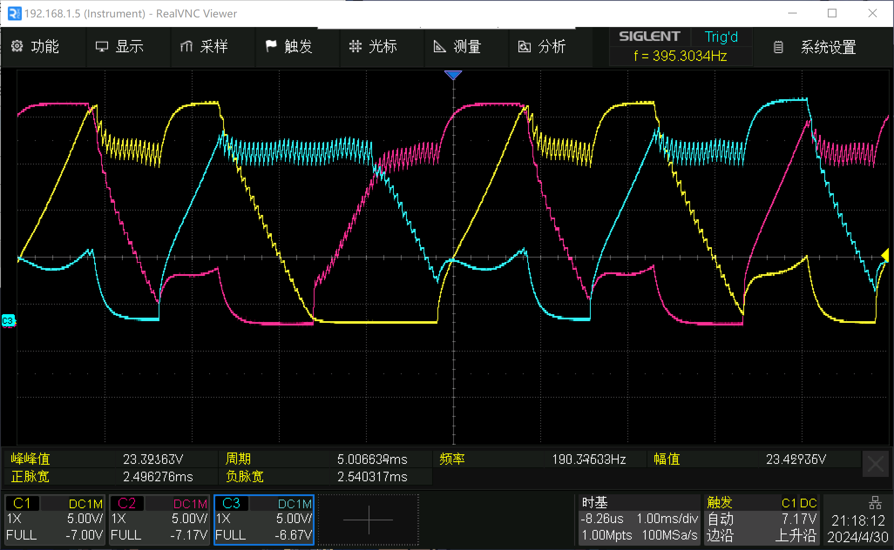
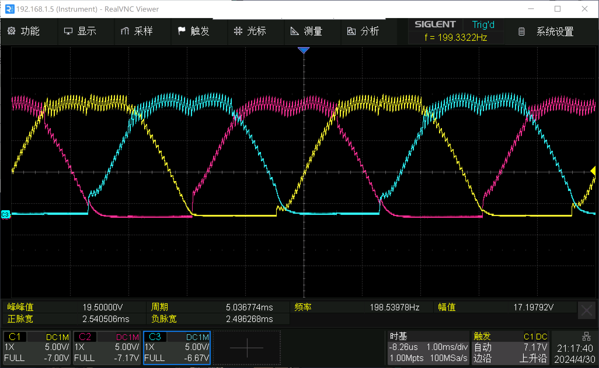
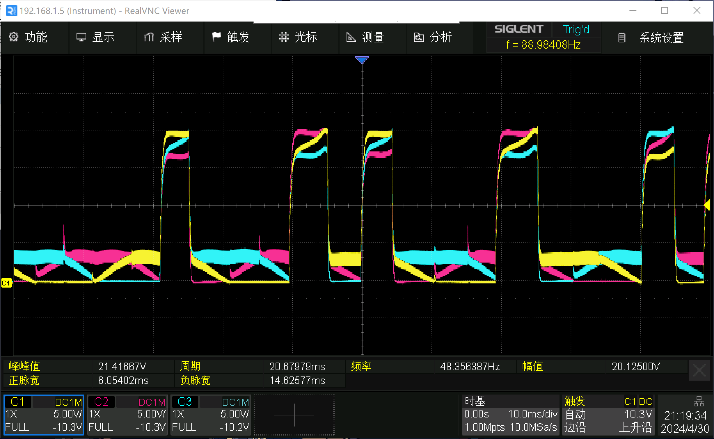
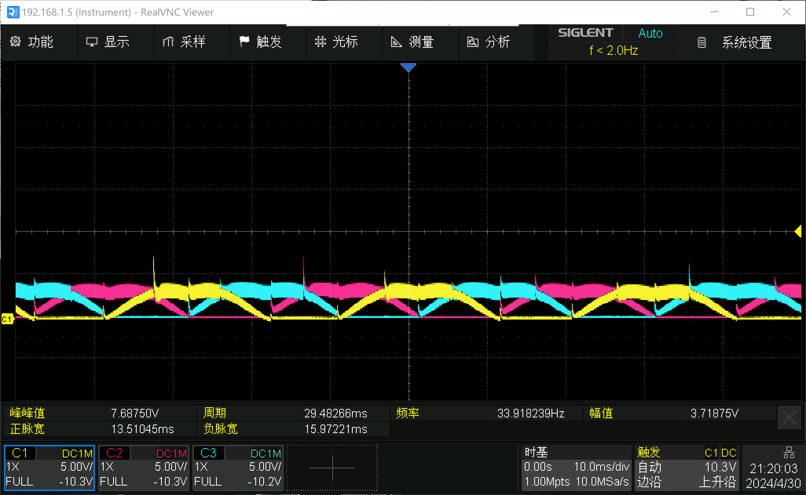

# STM32电机控制

## 测试环境

### 测试平台

* 主控芯片：STM32H743IIT6
* 直流无刷电机功率部分：18\~60V，1\~10A

### 电机参数

直流无刷电机：

1. 最高转速为4000rpm
2. 4磁极对
3. 霍尔传感器角度为120度

## 项目目录

### BLDC_HALL_6STEP_SPEED

使用ST-HAL库编写，通过霍尔传感器获取电机相位，六步换相法对直流无刷电机进行速度闭环控制的程序。

### BLDC_HALL_6STEP_SPEED_LL

使用ST-LL库编写，通过霍尔传感器获取电机相位，六步换相法对直流无刷电机进行速度闭环控制的程序。

HAL库编写的程序在示波器抓取波形表现并不好，效率不高，采用LL库有较好的改善，

HAL库高速：

LL库高速：

HAL库低速：

LL库低速：

### BLDC_HALL_ENCODER_6STEP_SPEED_LOCATION_LL

采用串级PID控制器，外环为位置环内环为速度环，进行的双环位置控制，可选择内环恒速控制功能。

## OUTPUT SPWM

通过输出正弦波对直流无刷电机进行开环正反转控制的程序。
